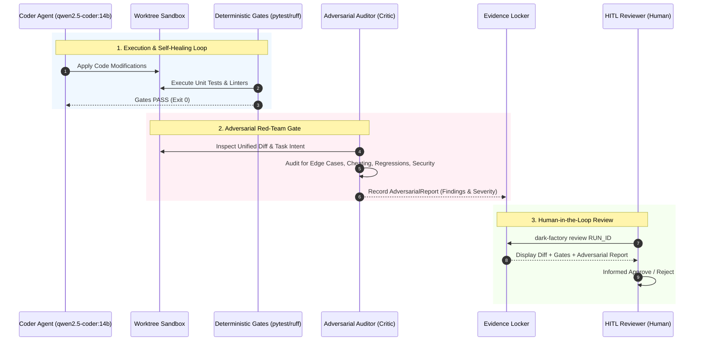

# Adversarial Pipeline & Red-Teaming

In the Sovereign Dark Factory, **verification is authoritative, but models have blind spots**. 

A patch that passes existing unit tests is not necessarily robust or secure. Models can produce code that passes naive test suites through hardcoded branches, tautological assertions, or unhandled edge cases. To guarantee production-grade autonomy without cloud dependencies, the factory integrates an **Adversarial Pipeline**.

---

## 🎯 The Core Thesis

> *"Do not ask the builder if the bridge is sound. Hire an attacker to bring it down."*

In traditional agent workflows, the same model that writes the implementation is often asked to verify or explain it. This creates **confirmation bias**:
- The model believes its solution is correct and cannot see its own implicit assumptions.
- Existing tests may only cover the "happy path."
- The model might introduce subtle regressions or security leaks (e.g., path traversal, memory bloat) that existing test gates never checked for.

The **Adversarial Pipeline** introduces an independent, dedicated Red-Team evaluation that treats every generated patch with aggressive skepticism.

---

## 📍 Where the Adversarial Pipeline Sits

The factory architecture embeds adversarial evaluation at two critical pipeline gates:



### 1. Primary Gate: Post-Verification Red-Team Audit (Pre-Review)
- **Position**: Immediately after deterministic verification gates pass, before the run transitions to `AWAITING_REVIEW`.
- **Role**: A red-team auditor inspects the unified `diff.patch` against the original task specification and worktree state.
- **Auditing Objectives**:
  - **Cheating & Tautology Detection**: Did the agent return hardcoded results (`if x == 42: return True`) instead of generalized logic?
  - **Edge Case Stress**: What boundary conditions (empty lists, NUL bytes, concurrency, extreme inputs) will break this implementation?
  - **Security & Blast Radius**: Did the patch introduce path traversal vulnerabilities, unescaped shell strings, or secret leaks?
  - **Performance & Regressions**: Did the agent replace an $O(1)$ lookup with an $O(N^2)$ scan or introduce potential CPU spins?
- **Output**: An immutable `AdversarialReport` stored in the Evidence Locker (`adversarial.md` and `manifest.json`).

### 2. Secondary Gate: In-Loop Adversarial Test Generation (Active Stress Testing)
- **Position**: Integrated into the `VerificationRunner` during self-healing.
- **Role**: The red-team model generates dynamic, adversarial test cases (`test_adversarial_*.py`) that challenge the coder's implementation.
- **Rule**: If the code fails the adversarial test suite, it re-enters the self-healing loop. When the run succeeds, the adversarial tests are preserved as permanent regression gates.

---

## 🛡️ The Four Adversarial Checks

Every patch submitted to the adversarial audit is evaluated against four specific dimensions:

| Dimension | Attack Vector | What the Red-Team Looks For |
| :--- | :--- | :--- |
| **1. Anti-Cheating** | Shortcut implementations | Dummy returns, deleted assertions, mocked-out internal functions, or bypass flags. |
| **2. Boundary Invariants** | Unhandled edge cases | Integer overflows, division by zero, `None`/null dereferences, empty collections, UTF-8 decoding anomalies. |
| **3. Security & Isolation** | Traversal & Injection | Subprocess injection via raw strings, path traversal outside the repo root, insecure temp files, unsafe deserialization. |
| **4. Architectural Drift** | Leaky abstractions | Introducing forbidden dependencies, violating zero-cloud token rules, breaking domain encapsulation. |

---

## 💻 Zero-Cloud Local Execution

The adversarial pipeline runs **100% locally** on workstation hardware:

- **Sequential Pipeline**: The Red-Team Auditor runs *after* the coder finishes its self-healing loop. On a 12 GB GPU (RTX 5070), this allows running a high-reasoning 14B model (e.g. `deepseek-r1:14b` or a specialized adversarial prompt on `qwen2.5-coder:14b`) with zero VRAM competition.
- **Deterministic Grounding**: The auditor is provided only with:
  1. The original `TaskSpec` prompt and constraints.
  2. The exact `diff.patch`.
  3. The verification gate outputs.
- The auditor does not write code to the sandbox; it acts as a pure read-only critic to eliminate recursion risks and model drift.

---

## 🔍 Operator Review Experience

When the operator reviews a run via the CLI:

```bash
dark-factory review 20261001-145022-7f2a
```

The CLI outputs the patch alongside the **Adversarial Audit Summary**:

```text
==================================================
🛡️  ADVERSARIAL RED-TEAM REPORT: [WARNINGS DETECTED]
==================================================
Severity: MEDIUM
Summary: The patch implements the requested token bucket but lacks thread-safety locks.

Findings:
  [WARN] Concurrency: Mutex lock is released before decrementing tokens_remaining (line 42).
  [INFO] Boundary: Negative refill_rate is not rejected at constructor initialization.
  [PASS] Security: No path traversal or subprocess vulnerabilities detected.
  [PASS] Anti-Cheating: Implementation is generalized; no hardcoded test stubs.
==================================================
Apply this patch to main? [y/N]:
```

This transforms the operator from a manual line-by-line debugger into an executive decision-maker informed by an automated red-team audit.
