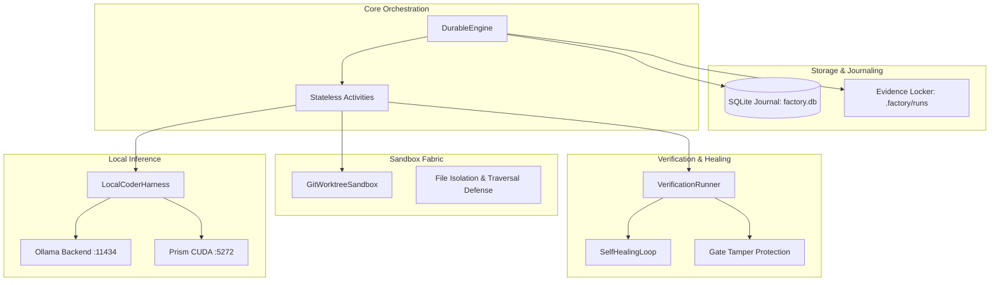

# System Architecture

The **Sovereign Dark Factory** implements a clean layered architecture designed around the **Option C** pattern: stateless, idempotent domain activities orchestratable by an embedded SQLite workflow engine or pluggable into enterprise temporal engines.

---

## 🏛️ Architecture Overview

---

## 🧩 Architectural Layers

### 1. Domain Layer (`dark_factory.domain`)
- **`RunStatus`**: State machine defining non-terminal (`PENDING`, `CREATING_SANDBOX`, `AGENT_RUNNING`, `VERIFYING`, `SELF_HEALING`, `AWAITING_REVIEW`) and terminal states (`APPROVED`, `REJECTED`, `FAILED`, `TIMED_OUT`, `CANCELLED`).
- **`TaskSpec`**: Input contract defining repo path, base git revision, prompt, model name, verification gates, and tamper policies.
- **`EvidenceManifest`**: Immutable audit record storing run metadata, patch SHA256 digest, telemetry, and gate results.

### 2. Sandbox Fabric (`dark_factory.sandbox`)
- **`GitWorktreeSandbox`**: Creates detached worktrees on the host filesystem in `<100ms`.
- **Directory Traversal Defense**: Enforces strict path bounds checking on all read/write operations.
- **Bytecode Purging**: Cleans `__pycache__` and `*.pyc` before calculating git diffs.
- **Gate Restoration**: Restores protected baseline test scripts before running tests.

### 3. Verification & Self-Healing (`dark_factory.verification`)
- **`VerificationRunner`**: Deterministic test runner executing structured `argv` commands sequentially.
- **Zero-Gate Detection**: Aborts runs with zero gates unless explicitly bypassed.
- **`SelfHealingLoop`**: Captures exit codes, stdout, and stderr from failed runs, merges them with the original task specification, and re-prompts the local LLM.

### 4. Local Inference Harness (`dark_factory.harness`)
- **`LocalCoderHarness`**: Multi-engine local router.
- **Automatic Fallback**: Attempts Ollama first (`/api/generate`), falling back to Prism CUDA (`/v1/chat/completions`).
- **Telemetry Collection**: Captures prompt tokens, completion tokens, duration, and calculates tokens per second.

### 5. Durable Workflow Engine (`dark_factory.orchestrator`)
- **`DurableEngine`**: Embedded SQLite journal providing atomic state transitions, crash recovery, and operator review gates.
- **Crash Safety**: Preserves runs awaiting operator review and prunes dead worktrees.
- **Evidence Locker**: Preserves `diff.patch`, `manifest.json`, `transcript.log`, and `telemetry.json`.
