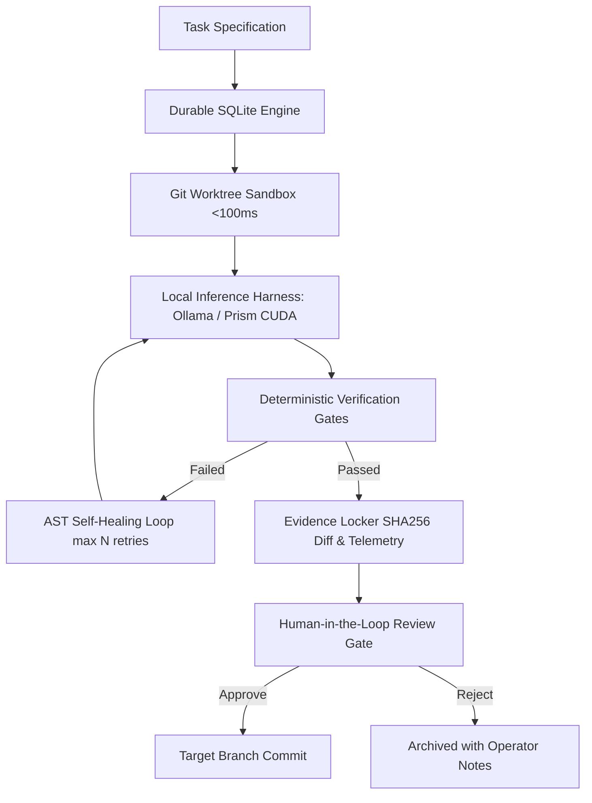

# Sovereign Dark Factory (`local-dark-factory`)

[](https://github.com/senssei/local-dark-factory/blob/main/LICENSE)
[](local-inference.md)
[](local-inference.md)
[](https://github.com/senssei/local-dark-factory/actions/workflows/ci.yml)
[](https://pypi.org/project/local-dark-factory/)

A 100% sovereign, local-first **autonomous AI Software Factory orchestrator** designed to coordinate local coding agents in fast, disposable git worktrees, enforce authoritative deterministic verification gates, auto-repair syntax and test failures, preserve tamper-evident patches, and provide human-in-the-loop review.

> *"Make sure you own your AI. AI in the cloud is not aligned with you; it’s aligned with the company that owns it."*

---

## 🌟 Core Pillars



1. **Zero Cloud Tokens**: Operates 100% locally on workstation hardware (NVIDIA RTX 5070 / Apple Silicon Metal). Never makes external cloud API calls ($0.00 token cost).
2. **Sub-100ms Disposable Sandboxes**: Eliminates heavyweight Docker overhead by utilizing native `git worktree` isolation with directory sanitization.
3. **Authoritative Verification Gates**: Verification is deterministic (compiler, linters, test suites). The LLM cannot vote on whether its own code works.
4. **Gate Tamper Resistance**: Automatic baseline restoration prevents the model from weakening assertions, commenting out tests, or modifying test runners to fake a pass.
5. **Durable SQLite Journaling**: State transitions, audit logs, and human operator notes survive system crashes and reboots.
6. **Self-Healing Loop**: Feeds compiler diagnostics and test assertion failures back to the local model up to configurable retry limits.

---

## ⚡ Quick Start

```bash
# Install local-dark-factory
pip install local-dark-factory

# Check local engines and GPU health
dark-factory doctor

# Run an autonomous task against a repository
dark-factory run \
  --repo /path/to/project \
  --task "Fix bug in calculation algorithm and ensure all pytest cases pass"
```

---

## 📖 AI-Native SDLC Architecture

This project is built from the ground up according to Anthropic's **[AI-Native SDLC Playbook](https://claude.com/blog/the-ai-native-sdlc-playbook)**:

| Specification Artifact | Role in Factory |
|---|---|
| [**Intent (`intent.md`)**](sdlc/intent.md) | Business rationale, sovereignty mandate, and hardware constraints. |
| [**Technical Spec (`spec.md`)**](sdlc/spec.md) | Data contracts, architecture choices, and activity contracts. |
| [**Operating Manual (`CLAUDE.md`)**](sdlc/claude.md) | Coding standards, safety rules, and test guidelines. |
| [**Agent Guidelines (`AGENTS.md`)**](sdlc/agents.md) | Local inference skills routing and zero-cloud-token rule. |
| [**Governance Policy (`REVIEW.md`)**](sdlc/review.md) | Operator approval criteria and diff inspection. |
