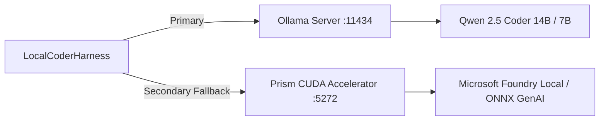

# Local Inference & Zero Cloud Tokens

The defining constraint of the **Sovereign Dark Factory** is **Zero Cloud Tokens**. The entire coding, testing, and self-healing loop operates on your workstation hardware without incurring API costs or sending private code to third-party servers.

---

## 🎯 The Sovereignty Mandate

Cloud LLM APIs introduce three fundamental liabilities for autonomous software development:
1. **Financial Risk**: Unbounded self-healing retry loops can drain API credits rapidly.
2. **Privacy & Security**: Proprietary codebases and sensitive IP leave your infrastructure.
3. **Vendor Alignment**: Cloud models may be deprecated, rate-limited, or aligned with vendor interests rather than engineering correctness.

Local Dark Factory runs on consumer GPU hardware with **$0.00** variable token cost.

---

## 🖥️ Supported Inference Backends



### 1. Ollama (`http://localhost:11434`)
Ollama is the recommended default backend for general coding and refactoring tasks.
- **Recommended Model**: `qwen2.5-coder:14b` (requires ~9GB VRAM in 4-bit quantization).
- **Lightweight Alternative**: `qwen2.5-coder:7b` (requires ~5GB VRAM).

To pull the recommended model:
```bash
ollama pull qwen2.5-coder:14b
```

### 2. Prism CUDA Accelerator (`http://127.0.0.1:5272/v1`)
Prism is a high-throughput OpenAI-compatible inference server powered by ONNX Runtime GenAI and DirectML/CUDA.
- Sub-millisecond TTFT (Time to First Token).
- Zero memory leaks across thousands of autonomous runs.

---

## 📊 Telemetry & Cost Accounting

Every run records an audit telemetry object inside the evidence locker:

```json
{
  "engine": "ollama",
  "model_name": "qwen2.5-coder:14b",
  "prompt_tokens": 1420,
  "completion_tokens": 680,
  "total_tokens": 2100,
  "duration_sec": 14.82,
  "tokens_per_sec": 45.88,
  "cost_usd": 0.0
}
```

Telemetry is accumulated cumulatively across all self-healing retry attempts.
