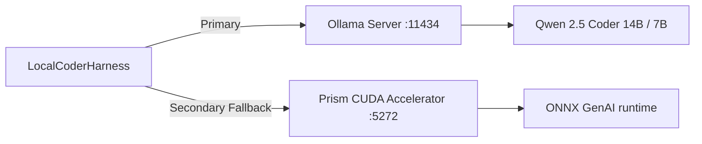

# Local Inference & Zero Cloud Tokens

The defining constraint of the **Sovereign Dark Factory** is **Zero Cloud Tokens**. The entire coding, testing, and self-healing loop operates on your workstation hardware without incurring API costs or sending private code to third-party servers.

---

## 🎯 The Sovereignty Mandate

Cloud LLM APIs introduce three fundamental liabilities for autonomous software development:
1. **Financial Risk**: Unbounded self-healing retry loops can drain API credits rapidly.
2. **Privacy & Security**: Proprietary codebases and sensitive IP leave your infrastructure.
3. **Vendor Alignment**: Cloud models may be deprecated, rate-limited, or aligned with vendor interests rather than engineering correctness.

Local Dark Factory runs on consumer GPU hardware with **$0.00** variable token cost.

---

## 🖥️ Supported Inference Backends


```mermaid
graph LR
    Harness[LocalCoderHarness] -->|Primary| Ollama[Ollama Server :11434]
    Harness -->|Secondary Fallback| Prism[Prism CUDA Accelerator :5272]
    Ollama --> Qwen[Qwen 2.5 Coder 14B / 7B]
    Prism --> ONNX[ONNX GenAI runtime]
```

### 1. Ollama (`http://localhost:11434`)
Ollama is the recommended default backend for general coding and refactoring tasks.
- **Recommended Model**: `qwen2.5-coder:14b` (requires ~9GB VRAM in 4-bit quantization).
- **Lightweight Alternative**: `qwen2.5-coder:7b` (requires ~5GB VRAM).

To pull the recommended model:
```bash
ollama pull qwen2.5-coder:14b
```

#### Context window sizing

Ollama's default context window is model/version dependent (4096 tokens on Ollama 0.34, measured here) and it **silently
truncates a longer prompt** to roughly half the window, losing the start of the prompt, which is where the file-format rules
live. The model then answers in prose instead of `file:` blocks. The harness therefore sizes the window itself:

- It estimates the prompt (about 3 characters per token, deliberately pessimistic), reserves room for the reply (at least as many
  tokens as the inlined files, since whole files are re-emitted) and sends `options.num_ctx` between 4096 and `max_num_ctx`.
- If the prompt plus reserve does not fit `max_num_ctx` (default **8192**), the run step fails *before* any model call with a
  message that suggests `--target-file`.
- If the reply has no `file:` block and the reported `prompt_eval_count` is about half the window (`num_ctx / 2 + 2`) or a
  full window, the error says the prompt was probably truncated. This is a heuristic tied to Ollama's observed behavior and it
  never discards a reply that contains valid file blocks.
- Gate output in repair prompts is capped at 6000 characters and the diff given to the auditor and mutator at 12000, so a big
  failure dump or patch does not by itself exceed the window.
- Because the model re-emits whole files, a single `--target-file` is limited to roughly 12 KB (about 300 lines) with the
  default window.
- The window used is recorded as `num_ctx` in `telemetry.json`. Prism's endpoint has no per-request window, so only the
  pre-flight estimate protects that path.

Measured on this workstation (RTX 5070 12 GB, `qwen2.5-coder:14b`, a ~4800-token prompt):

| `num_ctx` | time | model in VRAM |
|---|---|---|
| 4096 (default) | 7-8 s, prompt truncated | 9.5 / 9.5 GB |
| **8192** | **33 s** | **10.3 / 10.3 GB** |
| 12288 | 77 s | 10.5 / 11.6 GB |
| 16384 | 137 s | 10.2 / 12.4 GB |

8192 is the default because it still fits entirely in VRAM; larger windows spill to the CPU and are several times slower.

### 2. Prism CUDA Accelerator (`http://127.0.0.1:5272/v1`)
Prism is a high-throughput OpenAI-compatible inference server powered by ONNX Runtime GenAI and DirectML/CUDA.

### GPU compatibility

| Backend | Accelerators documented by this project |
|---|---|
| Ollama | NVIDIA CUDA; Apple Silicon (Metal) |
| Prism | ONNX Runtime GenAI with DirectML / CUDA |

The factory has no MLX or Apple Foundation Models fallback; on Apple Silicon, Metal is reached only through Ollama. Other accelerators (for example ROCm) and CPU-only operation depend on the backend itself and are not verified by this project.

---|---|---|---|---|
| Ollama | Yes | - | Yes | Yes |
| Prism | Yes | Yes | No | - |

There is no MLX or Apple Foundation Models fallback. On Apple Silicon use Ollama only.

---

## 📊 Telemetry & Cost Accounting

Every run records an audit telemetry object inside the evidence locker:

```json
{
  "engine": "ollama",
  "model_name": "qwen2.5-coder:14b",
  "prompt_tokens": 1420,
  "completion_tokens": 680,
  "total_tokens": 2100,
  "duration_sec": 14.82,
  "tokens_per_sec": 45.88,
  "cost_usd": 0.0
}
```

Telemetry is accumulated cumulatively across all self-healing retry attempts.
