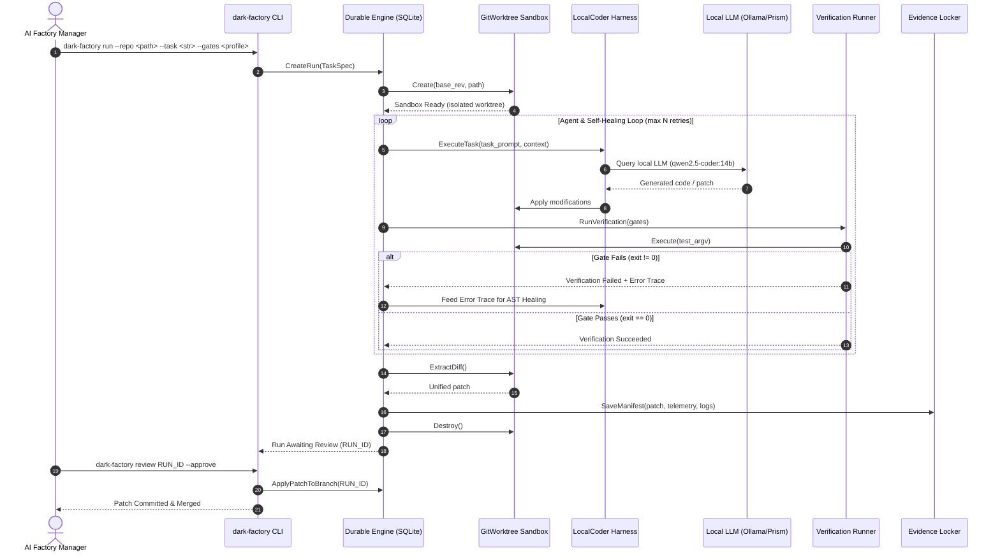

# Specification: Sovereign Dark Factory (`local-dark-factory`)

## 1. System Architecture

The Sovereign Dark Factory implements a 6-stage lifecycle for autonomous code modification:



---

## 2. Core Domain Data Contracts

```python
from enum import Enum
from dataclasses import dataclass, field
from typing import List, Dict, Optional, Any
from datetime import datetime

class RunStatus(str, Enum):
    PENDING = "PENDING"
    CREATING_SANDBOX = "CREATING_SANDBOX"
    AGENT_RUNNING = "AGENT_RUNNING"
    VERIFYING = "VERIFYING"
    SELF_HEALING = "SELF_HEALING"
    AWAITING_REVIEW = "AWAITING_REVIEW"
    APPROVED = "APPROVED"
    REJECTED = "REJECTED"
    FAILED = "FAILED"
    TIMED_OUT = "TIMED_OUT"
    CANCELLED = "CANCELLED"

@dataclass
class VerificationStep:
    id: str
    argv: List[str]
    timeout_sec: int = 300
    mandatory: bool = True
    cwd: Optional[str] = None

@dataclass
class StepExecution:
    step_id: str
    exit_code: int
    stdout: str
    stderr: str
    duration_sec: float
    timed_out: bool = False

@dataclass
class TaskSpec:
    repo_path: str
    task_prompt: str
    base_rev: str = "HEAD"
    agent: str = "local-coder"
    model: str = "qwen2.5-coder:14b"
    verification_steps: List[VerificationStep] = field(default_factory=list)
    allow_no_verify: bool = False
    protected_paths: List[str] = field(default_factory=list)
    allow_gate_edits: bool = False
    max_healing_attempts: int = 3
    timeout_minutes: int = 30
    metadata: Dict[str, Any] = field(default_factory=dict)

@dataclass
class ModelTelemetry:
    engine: str
    model_name: str
    prompt_tokens: int = 0
    completion_tokens: int = 0
    total_tokens: int = 0
    duration_sec: float = 0.0
    tokens_per_sec: float = 0.0
    cost_usd: float = 0.0

@dataclass
class EvidenceManifest:
    run_id: str
    status: RunStatus
    repo_path: str
    base_rev: str
    created_at: str
    completed_at: Optional[str] = None
    resulting_rev: Optional[str] = None
    patch_path: Optional[str] = None
    patch_size_bytes: int = 0
    patch_sha256: Optional[str] = None
    healing_attempts: int = 0
    verification_results: List[StepExecution] = field(default_factory=list)
    model_telemetry: Optional[ModelTelemetry] = None
    operator_notes: Optional[str] = None
```

---

## 3. Subsystem Specifications

### 3.1. Sandbox Fabric (`dark_factory.sandbox`)

- **`GitWorktreeSandbox` (Default)**:
  - Uses `git worktree add --detach <sandbox_path> <base_rev>`.
  - Generates zero container overhead (<100ms startup).
  - Sanitizes environment variables to prevent host secret leaks.
  - Deletion via `git worktree remove --force <sandbox_path>`.

- **`DockerSandbox` (Optional)**:
  - Ephemeral container with restricted volume mounts and memory limits.

---

### 3.2. Local Agent Harness (`dark_factory.harness`)

- **`LocalCoderHarness`**:
  - Unified local inference harness.
  - Calls local LLM endpoints (Ollama `/api/generate` or Prism `/v1/chat/completions`).
  - Supports automatic engine fallbacks:
    - Primary: Ollama (`qwen2.5-coder:14b`).
    - Secondary: Prism CUDA (`http://127.0.0.1:5272/v1`).
    - Tertiary: Microsoft Foundry Local.
  - Collects token generation counts, elapsed time, and tokens/sec telemetry.

- **`OpenCodeHarness`**:
  - Headless driver for local autonomous coding agents.
  - Configures agent runners to use local OpenAI-compatible endpoints.

---

### 3.3. Deterministic Verification & Self-Healing (`dark_factory.verification`)

- **Verification Contract**:
  - Runs each step in `TaskSpec.verification_steps` in strict sequence.
  - Any mandatory step with `exit_code != 0` immediately triggers the healing protocol.
- **Self-Healing Loop**:
  - If a gate fails, the runner packages:
    1. The failing gate command and exit code.
    2. Combined `stderr` and relevant `stdout` output.
    3. The files modified in the current attempt.
  - It creates a repair prompt:
    ```
    Your recent changes failed deterministic verification.
    Gate: {step_id}
    Error Output:
    {error_trace}
    
    Fix the errors so that the verification gate passes cleanly.
    ```
  - Loops up to `max_healing_attempts`. If it fails after all retries, the run status is marked `FAILED` and changes are preserved for operator inspection.

---

### 3.4. Durable Workflow Engine (`dark_factory.orchestrator`)

- **Database**: SQLite database stored at `.factory/factory.db`.
- **Durability**:
  - Atomic transaction for every state transition.
  - In-flight runs that crash can be resumed or cleanly rolled back via `dark-factory recover`.
  - Event log table captures all transition events with ISO 8601 timestamps.

---

### 3.5. Evidence Locker (`dark_factory.storage`)

Stored at `.factory/runs/<RUN_ID>/`:
- `diff.patch`: Unified diff of all modifications.
- `manifest.json`: Full `EvidenceManifest` data contract.
- `transcript.log`: Complete stdout/stderr trace of agent and verification runs.
- `telemetry.json`: GPU and model performance stats.

---

## 4. Operational Commands (CLI)

```bash
dark-factory doctor
dark-factory run --task "TASK"
dark-factory list
dark-factory describe <RUN_ID>
dark-factory review <RUN_ID> --approve [--branch <NAME>]
dark-factory review <RUN_ID> --reject [--note <REASON>]
dark-factory recover
```
