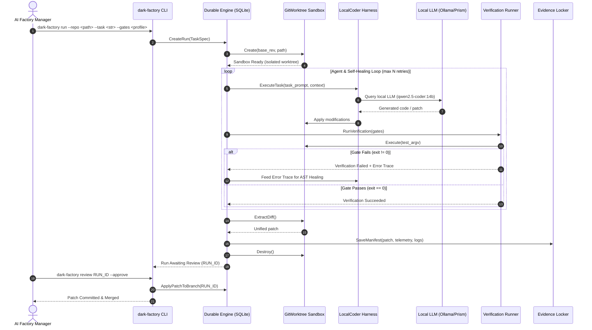

# Specification: Sovereign Dark Factory (`local-dark-factory`)

## 1. System Architecture

The Sovereign Dark Factory implements a 6-stage lifecycle for autonomous code modification:


```mermaid
sequenceDiagram
    autonumber
    actor Operator as AI Factory Manager
    participant CLI as dark-factory CLI
    participant Engine as Durable Engine (SQLite)
    participant Sandbox as GitWorktree Sandbox
    participant Harness as LocalCoder Harness
    participant Model as Local LLM (Ollama/Prism)
    participant Gate as Verification Runner
    participant Locker as Evidence Locker

    Operator->>CLI: dark-factory run --repo <path> --task <str> --gates <profile>
    CLI->>Engine: CreateRun(TaskSpec)
    Engine->>Sandbox: Create(base_rev, path)
    Sandbox-->>Engine: Sandbox Ready (isolated worktree)
    
    loop Agent & Self-Healing Loop (max N retries)
        Engine->>Harness: ExecuteTask(task_prompt, context)
        Harness->>Model: Query local LLM (qwen2.5-coder:14b)
        Model-->>Harness: Generated code / patch
        Harness->>Sandbox: Apply modifications
        Engine->>Gate: RunVerification(gates)
        Gate->>Sandbox: Execute(test_argv)
        alt Gate Fails (exit != 0)
            Gate-->>Engine: Verification Failed + Error Trace
            Engine->>Harness: Feed Error Trace for AST Healing
        else Gate Passes (exit == 0)
            Gate-->>Engine: Verification Succeeded
        end
    end

    Engine->>Sandbox: ExtractDiff()
    Sandbox-->>Engine: Unified patch
    Engine->>Locker: SaveManifest(patch, telemetry, logs)
    Engine->>Sandbox: Destroy()
    Engine-->>CLI: Run Awaiting Review (RUN_ID)

    Operator->>CLI: dark-factory review RUN_ID --approve
    CLI->>Engine: ApplyPatchToBranch(RUN_ID)
    CLI-->>Operator: Patch Committed & Merged
```

---

## 2. Core Domain Data Contracts

```python
from enum import Enum
from dataclasses import dataclass, field
from typing import List, Dict, Optional, Any
from datetime import datetime

class RunStatus(str, Enum):
    PENDING = "PENDING"
    CREATING_SANDBOX = "CREATING_SANDBOX"
    AGENT_RUNNING = "AGENT_RUNNING"
    VERIFYING = "VERIFYING"
    SELF_HEALING = "SELF_HEALING"
    AWAITING_REVIEW = "AWAITING_REVIEW"
    APPROVED = "APPROVED"
    REJECTED = "REJECTED"
    FAILED = "FAILED"
    TIMED_OUT = "TIMED_OUT"
    CANCELLED = "CANCELLED"

@dataclass
class VerificationStep:
    id: str
    argv: List[str]
    timeout_sec: int = 300
    mandatory: bool = True
    description: str = ""

@dataclass
class TaskSpec:
    repo_path: str
    task_prompt: str
    base_rev: str = "HEAD"
    agent: str = "local-coder"
    model: str = "qwen2.5-coder:14b"
    verification_steps: List[VerificationStep] = field(default_factory=list)
    max_healing_attempts: int = 3
    timeout_minutes: float = 30

@dataclass
class StepExecution:
    step_id: str
    exit_code: int
    stdout: str
    stderr: str
    duration_sec: float
    passed: bool

@dataclass
class PhaseTiming:
    """Wall-clock duration of one named run phase (sandbox_create, agent_and_verify, diff_extract,
    evidence_preserve, patch_apply). Lightweight local performance tracing: no external tracing
    backend, just timings recorded alongside the rest of the evidence."""
    phase: str
    duration_sec: float
    started_at: str

@dataclass
class EvidenceManifest:
    run_id: str
    created_at: str
    completed_at: str
    status: RunStatus
    repo_path: str
    base_rev: str
    resulting_rev: Optional[str]
    patch_path: str
    patch_size_bytes: int
    healing_attempts: int
    verification_results: List[StepExecution]
    model_telemetry: Dict[str, Any]
    phase_timings: List[PhaseTiming] = field(default_factory=list)
    total_cost_usd: float = 0.0
```

---

## 3. Component Specifications

### 3.1. Sandbox Layer (`dark_factory.sandbox`)

- **Interface `Sandbox`**:
  - `create(base_rev: str) -> None`: Prepares the sandbox.
  - `execute(argv: List[str], env: Optional[Dict[str, str]] = None, timeout: int = 600) -> StepExecution`: Runs structured argv without shell interpolation risks.
  - `write_file(rel_path: str, content: bytes) -> None`: Writes files into the sandbox.
  - `read_file(rel_path: str) -> bytes`: Reads files out.
  - `get_diff() -> str`: Runs `git diff HEAD` inside the sandbox to generate a clean, deterministic patch.
  - `destroy() -> None`: Cleans up the sandbox idempotently.

- **`GitWorktreeSandbox` (Default)**:
  - Uses `git worktree add --detach <sandbox_path> <base_rev>`.
  - Generates zero container overhead (<100ms startup).
  - Sanitizes environment variables to prevent host secret leaks.
  - Deletion via `git worktree remove --force <sandbox_path>`.
  - `write_file` / `read_file` reject path traversal; `write_file` additionally rejects any path that is or lies inside `.git` (the worktree `gitdir:` pointer must never be agent-writable).
  - `get_diff` is independent of user git configuration: it passes `--no-color --no-ext-diff --no-renames --src-prefix=a/ --dst-prefix=b/ --binary` (no rename detection, so every file appears once as `a/X b/X` and deletions are never lost when staging), and a failing `git` command raises `SandboxError` (it never yields a silent empty patch).
  - **Isolation limit (known):** the worktree isolates the *repository*, not the *process*. Verification steps execute on the host with the sanitized environment and network access. Stronger process isolation is tracked in `plan.md` §10.5.

- **`DockerSandbox` (Optional)**:
  - Ephemeral container with restricted volume mounts and memory limits.

---

### 3.2. Local Agent Harness (`dark_factory.harness`)

- **`LocalCoderHarness`**:
  - Unified local inference harness.
  - Calls local LLM endpoints (Ollama `/api/generate` or Prism `/v1/chat/completions`).
  - Supports automatic engine fallbacks:
    - Primary: Ollama (`qwen2.5-coder:14b`).
    - Secondary: Prism CUDA (`http://127.0.0.1:5272/v1`).
    - Tertiary: Microsoft Foundry Local.
  - Collects token generation counts, elapsed time, and tokens/sec telemetry.
  - **File block protocol:** each file is emitted as `` ```file:<path> `` … `` ``` ``. Parsing is line-based and nesting-aware: a fence with an info string (`` ```python ``) inside a file opens a nested block, a bare fence closes it, and only a bare fence at depth 0 (at least as long as the opening one) terminates the file. File contents may therefore contain balanced markdown code fences (READMEs, docstrings) without being truncated. A block that is never terminated (truncated model output) is discarded, never written half-complete.

- **`OpenCodeHarness`**:
  - Headless driver for local autonomous coding agents.
  - Configures agent runners to use local OpenAI-compatible endpoints.

---

### 3.3. Deterministic Verification & Self-Healing (`dark_factory.verification`)

- **Verification Contract**:
  - Runs each step in `TaskSpec.verification_steps` in strict sequence.
  - Any mandatory step with `exit_code != 0` immediately triggers the healing protocol.
- **Gate Protection**:
  - Before verification, protected paths are restored to `base_rev` (unless `--allow-gate-edits`).
  - Default protected set = every path-like argv token of the configured steps (matched by prefix removal, never character stripping) plus `tests`, `test`, `test.sh`, `pytest.ini`, `tox.ini`, and the test-runner configuration files `pyproject.toml`, `setup.cfg`, `conftest.py` (any depth), `.coveragerc`, `sitecustomize.py`, `usercustomize.py`.
- **No-op is not success**: a run whose gates pass but whose patch is empty ends `FAILED` (`reason: empty_patch`); only a non-empty, verified patch may reach `AWAITING_REVIEW`.
- **Self-Healing Loop**:
  - If a gate fails, the runner packages:
    1. The failing gate command and exit code.
    2. Combined `stderr` and relevant `stdout` output.
    3. The files modified in the current attempt.
  - It creates a repair prompt:
    ```
    Your recent changes failed deterministic verification.
    Gate: {step_id}
    Error Output:
    {error_trace}
    
    Fix the errors so that the verification gate passes cleanly.
    ```
  - Loops up to `max_healing_attempts`. If it fails after all retries, the run status is marked `FAILED` and changes are preserved for operator inspection.

---

### 3.4. Durable Workflow Engine (`dark_factory.orchestrator`)

- **Database**: SQLite database stored at `.factory/factory.db`.
- **Durability**:
  - Atomic transaction for every state transition.
  - In-flight runs that crash can be resumed or cleanly rolled back via `dark-factory recover`.
  - Event log table captures all transition events with ISO 8601 timestamps.
- **Lifecycle guarantees**:
  - `TaskSpec.timeout_minutes` is a hard deadline for the whole run (agent + verification); on expiry the run ends `TIMED_OUT`.
  - `KeyboardInterrupt` / `SystemExit` end the run `CANCELLED`; the sandbox is destroyed and evidence saved on every exit path.
  - Evidence (`diff.patch`, `manifest.json`) is persisted **before** the DB transition to `AWAITING_REVIEW`, so a crash can never leave a review-pending run without evidence. `manifest.json` is written last and atomically; `recover()` adopts the outcome of a run whose manifest is readable and whose patch digest matches, and marks every other orphan `FAILED`.
  - The deadline is checked at every phase boundary (before each model call and each verification pass) and clamps each gate's timeout to the time remaining. A single in-flight model call is not interrupted, so a run can overrun by at most one harness call (`LocalCoderHarness.timeout`).
  - `review --approve` is atomic with respect to the host repository: if applying fails after a branch was created, the original branch is restored and the new branch deleted.
- **Performance tracing**: `EvidenceManifest.phase_timings` records the wall-clock duration of `sandbox_create`, `agent_and_verify`, `diff_extract`, and `evidence_preserve` (`execute_run`), and `patch_apply` (`review_run`) — recorded on every exit path, including `TIMED_OUT` and `CANCELLED`. This is the entire tracing mechanism: no external backend, just timings alongside the rest of the evidence (Zero Cloud Tokens / local-first). `dark-factory describe` prints them.

---

### 3.5. Evidence Locker (`dark_factory.storage`)

Stored at `.factory/runs/<RUN_ID>/`:
- `diff.patch`: Unified diff of all modifications.
- `manifest.json`: Full `EvidenceManifest` data contract.
- `transcript.log`: Complete stdout/stderr trace of agent and verification runs.
- `telemetry.json`: GPU and model performance stats.

---

### 3.6. CLI & Operator Controls (`dark_factory.cli`)

- `dark-factory doctor`: Verifies Ollama, Prism, GPU VRAM, git binary.
- `dark-factory run`: Submits a task.
- `dark-factory status [RUN_ID] [--watch]`: Streams execution status.
- `dark-factory describe RUN_ID`: Prints manifest, conditions, and diff.
- `dark-factory review RUN_ID --approve [--branch <name>]`: Applies the patch to the target branch.
- `dark-factory review RUN_ID --reject [--note <reason>]`: Rejects and archives the run.

---

### 3.7. Eval Harness (`dark_factory.eval`)

- **Purpose**: a repeatable, scriptable benchmark for measuring self-healing convergence against a real
  local model, replacing ad-hoc one-off scripts.
- **`EvalScenario`** (`dark_factory.eval.scenarios`): a frozen dataclass — `name: str`, `description: str`,
  `build_repo: Callable[[Path], None]` (scaffolds a throwaway git repo with a specific, known bug at the
  given path), `task_prompt: str`, `verification_steps: Callable[[], list[VerificationStep]]` (a factory,
  since argv embeds `sys.executable`), `protected_paths: list[str]`, `max_healing_attempts: int`,
  `timeout_minutes: float`. `SCENARIOS: dict[str, EvalScenario]` is the fixed registry (`primes`,
  `calculator`, `textutils`, `csvparse` at introduction). The same `build_*_repo` functions back both this
  registry and the `pytest` fixtures in `tests/test_e2e.py` — one scaffolding implementation, not two.
- **`EvalRunResult`** (`dark_factory.eval.runner`): one real `execute_run` attempt — `scenario`, `run_id`,
  `converged: bool` (`status == AWAITING_REVIEW`), `status`, `healing_attempts`,
  `repeated_failure_streak_fired: bool`, `duration_sec`, `prompt_tokens`, `completion_tokens`,
  `tokens_per_sec`, `operator_notes`.
- **`EvalReport`**: `started_at`, `finished_at`, `model`, `ollama_url`, `prism_url`,
  `results: list[EvalRunResult]`, `scenario_summary()` (per-scenario convergence rate and average healing
  attempts). Persisted as JSON at `.factory/evals/<ISO-timestamp>.json`.
- **Isolation invariant**: `run_eval(...)` drives scenarios through a **separate**
  `DurableEngine(storage_dir / "eval-runs")`, never the operator's main `.factory` run journal — throwaway
  scaffold-repo runs must never appear in `dark-factory list`/`review` or the dashboard's Runs view.
- **CLI**: `dark-factory eval [--scenario NAME ...] [--repeat N] [--model M] [--ollama-url U] [--prism-url U]
  [--storage-dir D] [--keep-repos] [--list]`. Gates on `LocalCoderHarness.check_health()`; exits `1` with a
  clear message (no silent degradation) when neither Ollama nor Prism is reachable. Never invoked by the
  default `pytest` suite (real-model, non-deterministic by nature — only `-m local_engine`, run by hand).

---

### 3.8. Local Dashboard (`dark_factory.dashboard`)

- **Purpose**: local, browser-based visibility into run history, evidence, and eval reports.
- **Read-only invariant**: the dashboard never mutates state. `DashboardRequestHandler` implements only
  `GET` routes (`/`, `/runs/<id>`, `/eval`, `/api/runs`, `/api/eval`); every other HTTP method returns
  `405 Method Not Allowed`. There is no approve/reject/submit action anywhere in the UI or API.
- **Network invariant**: `run_dashboard(storage_dir, port=8420, open_browser=True)` binds to `127.0.0.1`
  only — there is no `--host`/bind-address flag. The dashboard is never reachable from another machine.
- **No new dependency**: implemented entirely on the Python standard library (`http.server`). No web
  framework, no template engine — HTML is built by plain functions in `dark_factory.dashboard.views` with
  every interpolated value passed through `html.escape()`.
- **Data sources**: `EvidenceLocker.list_runs()`/`load_manifest()`/`load_patch()` for the Runs view — disk
  evidence only, deliberately not `DurableEngine`/SQLite, so the dashboard never opens a database connection
  for what is a purely read-only view (same underlying evidence `dark-factory list`/`describe` expose, just
  not routed through the SQLite journal); `dark_factory.eval.runner.list_eval_reports()`/`load_report()` for
  the Eval view. The dashboard reads `.factory/` state; it never triggers `execute_run`/`review_run` itself.
- **CLI**: `dark-factory dashboard [--port 8420] [--storage-dir D] [--no-browser]`.
