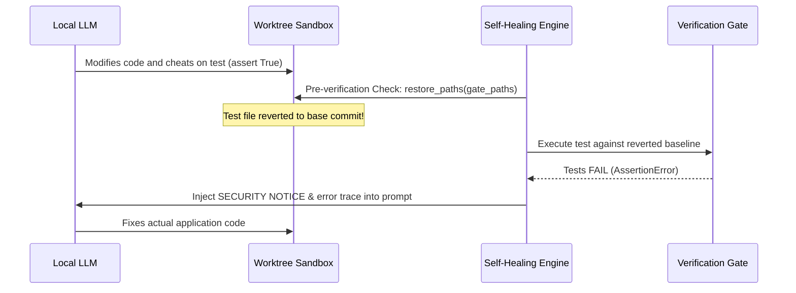

# Verification Gates & Self-Healing

In the Sovereign Dark Factory, **verification is authoritative and deterministic**. The coding model does not vote on whether its solution is correct; the test suite, compiler, and linters make the decision.

---

## 🔒 Authoritative Verification

A factory run must execute against defined gates:
- Unit test suites (`pytest`, `cargo test`, `npm test`, `go test`)
- Compilation / type checking (`mypy`, `tsc`, `rustc`)
- Linters and formatters (`ruff`, `eslint`)
- Integration scripts (`./test.sh`)

### Zero-Gate Rejection Policy
If a project has no verification scripts (`test.sh`, `tests/`) and no `--test-cmd` is provided, the factory will **refuse to run** (exit code 1). This prevents unsupervised, blind changes from being approved. To bypass this policy intentionally, pass `--no-verify`.

---

## 🛡️ Gate Tamper Resistance

One major vulnerability in autonomous coding agents is **gate evasion**: an agent that fails a test might "fix" the problem by commenting out assertions or deleting test files.

Local Dark Factory implements active gate tamper protection:



Before verification executes:
1. `GitWorktreeSandbox.restore_paths` identifies all gate files (e.g. `tests/`, `test.sh`, `pytest.ini`).
2. If any gate file was modified or deleted by the agent, it is **restored to its baseline revision**.
3. Any untracked test mocks or spoofed scripts are purged via `git clean -fd`.
4. Verification runs against the true, original tests.
5. If the agent attempted tampering, a `SECURITY NOTICE` is appended to the repair prompt.

---

## 🔄 Self-Healing Loop

When verification fails, the `SelfHealingLoop` engages up to `max_healing_attempts` (default: 3):

```text
ORIGINAL TASK:
Implement thread-safe token bucket rate limiter in limiter.py

REPAIR ATTEMPT #1 OF 3:
Your previous changes failed automated deterministic verification.
Gate 'pytest' failed with exit code 1.
STDERR:
FAILED tests/test_limiter.py::test_concurrency - AssertionError: expected 10 allowed, got 14

Please analyze the errors in the context of the original task and generate the corrected full file contents.
```

- **Prompt Retention**: The original prompt is preserved so the model does not drift from requirements.
- **Telemetry Aggregation**: Total tokens and elapsed execution time are summed across all attempts.
- **Syntactic Retry**: Responses that fail to generate proper file blocks are counted as a retry rather than an unhandled crash.
