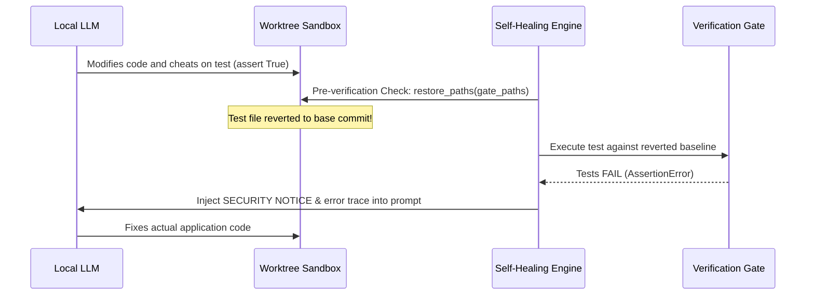

# Verification Gates & Self-Healing

In the Sovereign Dark Factory, **verification is authoritative and deterministic**. The coding model does not vote on whether its solution is correct; the test suite, compiler, and linters make the decision.

---

## 🔒 Authoritative Verification

A factory run must execute against defined gates:
- Unit test suites (`pytest`, `cargo test`, `npm test`, `go test`)
- Compilation / type checking (`mypy`, `tsc`, `rustc`)
- Linters and formatters (`ruff`, `eslint`)
- Integration scripts (`./test.sh`)

### Zero-Gate Rejection Policy
If a project has no verification scripts (`test.sh`, `tests/`) and no `--test-cmd` is provided, the factory will **refuse to run** (exit code 1). This prevents unsupervised, blind changes from being approved. To bypass this policy intentionally, pass `--no-verify`.

---

## 🛡️ Gate Tamper Resistance

One major vulnerability in autonomous coding agents is **gate evasion**: an agent that fails a test might "fix" the problem by commenting out assertions or deleting test files.

Local Dark Factory implements active gate tamper protection:


```mermaid
sequenceDiagram
    participant Agent as Local LLM
    participant Sandbox as Worktree Sandbox
    participant Healer as Self-Healing Engine
    participant Gate as Verification Gate

    Agent->>Sandbox: Modifies code and cheats on test (assert True)
    Healer->>Sandbox: Pre-verification Check: restore_paths(gate_paths)
    Note over Sandbox: Test file reverted to base commit!
    Healer->>Gate: Execute test against reverted baseline
    Gate-->>Healer: Tests FAIL (AssertionError)
    Healer->>Agent: Inject SECURITY NOTICE & error trace into prompt
    Agent->>Sandbox: Fixes actual application code
```

Before verification executes:
1. The `VerificationRunner` decides which paths are protected and `GitWorktreeSandbox.restore_paths` resets them. Unless the task sets explicit `protected_paths` (Python API only; this replaces the defaults) or `allow_gate_edits` (nothing is restored), the defaults are:
    - `tests`, `test`, `test.sh`, `pytest.ini`, `tox.ini`, `pyproject.toml`, `setup.cfg`, `.coveragerc`
    - at any depth: `conftest.py`, `sitecustomize.py`, `usercustomize.py`
    - every non-flag argument of a gate command other than a runner name (`python`, `python3`, `pytest`, `sh`, `bash`) or an `.exe`, taken as a path whether or not it exists
    - a gate command that invokes a linter or type-checker (`ruff`, `flake8`, `pylint`, `mypy`, `pyright`, `black`, `isort`) contributes no argv paths, because its targets are files the agent is expected to edit
2. If any gate file was modified or deleted by the agent, it is **restored to its baseline revision**.
3. Any untracked test mocks or spoofed scripts are purged via `git clean -fd`.
4. Verification runs against the true, original tests.
5. If the agent attempted tampering, a `SECURITY NOTICE` is appended to the repair prompt.

Python runner imports receive additional protection even with explicit `protected_paths`. For Python `-m` commands, the top-level module is protected; recognized console tools (`pytest`, `ruff`, `flake8`, `pylint`, `mypy`, `pyright`, `black`, `isort`) receive the same protection. Pytest also protects `_pytest` and `pluggy`. Runner modules, packages, legacy bytecode and matching root `__pycache__` entries are restored to the trusted baseline or removed if new, including ignored files. If restoration fails, the gate does not execute. Unrelated ignored files such as local environments remain outside this cleanup.

Tests still import edited application code. `allow_gate_edits` bypasses runner protection as well as ordinary gate restoration. This protects declared runner imports and pytest bootstrap modules; it does not cover arbitrary transitive imports, shell-script runner behavior or host process isolation.

---

## 🔄 Self-Healing Loop

When verification fails, the `SelfHealingLoop` engages up to `max_healing_attempts` (default: 3):

```text
ORIGINAL TASK:
Implement thread-safe token bucket rate limiter in limiter.py

REPAIR ATTEMPT #1 OF 3:
Your previous changes failed automated deterministic verification.
Gate 'pytest' failed with exit code 1.
STDERR:
FAILED tests/test_limiter.py::test_concurrency - AssertionError: expected 10 allowed, got 14

Please analyze the errors in the context of the original task and generate the corrected full file contents.
```

- **Prompt Retention**: The original prompt is preserved so the model does not drift from requirements.
- **Telemetry Aggregation**: Total tokens and elapsed execution time are summed across all attempts.
- **Syntactic Retry**: Responses that fail to generate proper file blocks are counted as a retry rather than an unhandled crash.

---

## 🛡️ Beyond Passing Gates: Adversarial Red-Teaming

Passing deterministic unit tests is necessary but not sufficient: an agent might write code that satisfies tests via trivial branches or misses critical boundary conditions. Before patches are presented to the operator, they undergo automated red-teaming. See [Adversarial Pipeline](adversarial-pipeline.md) for how the factory audits green patches for cheating, boundary defects, and security risks.
